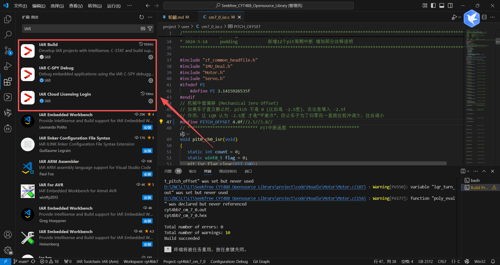
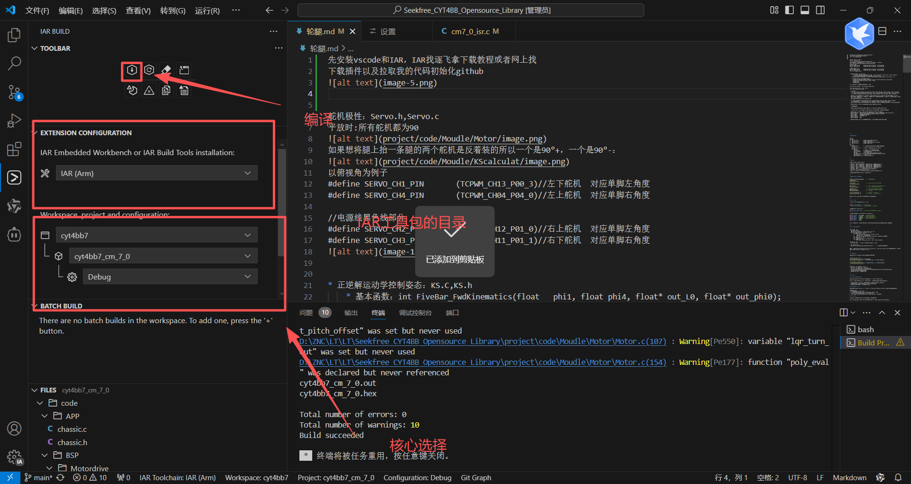
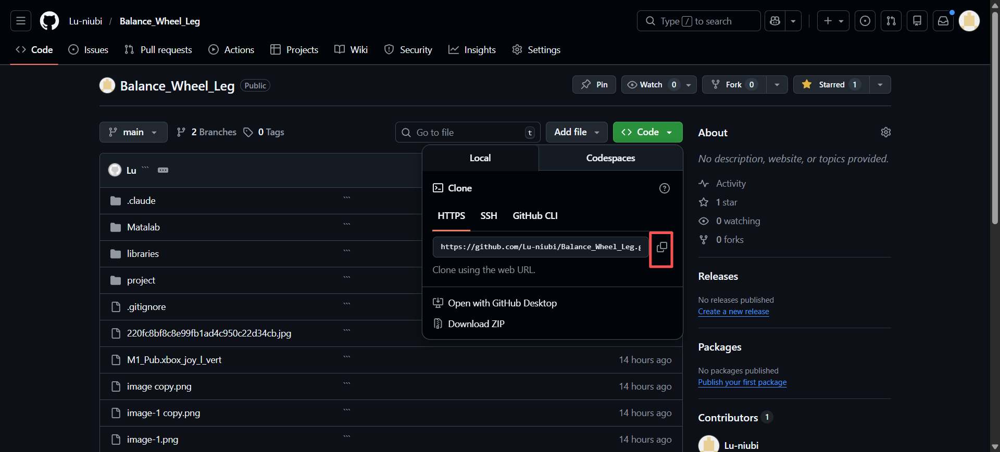
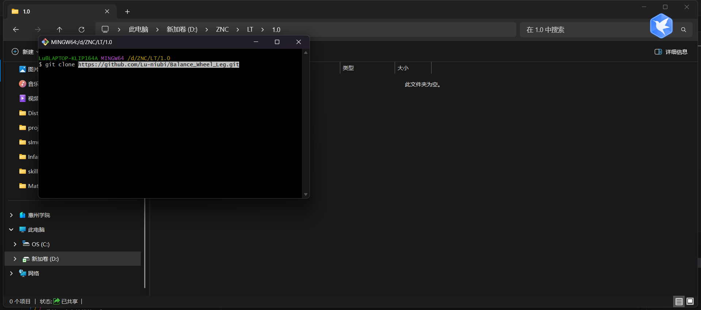
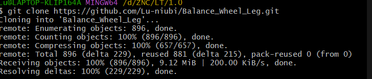
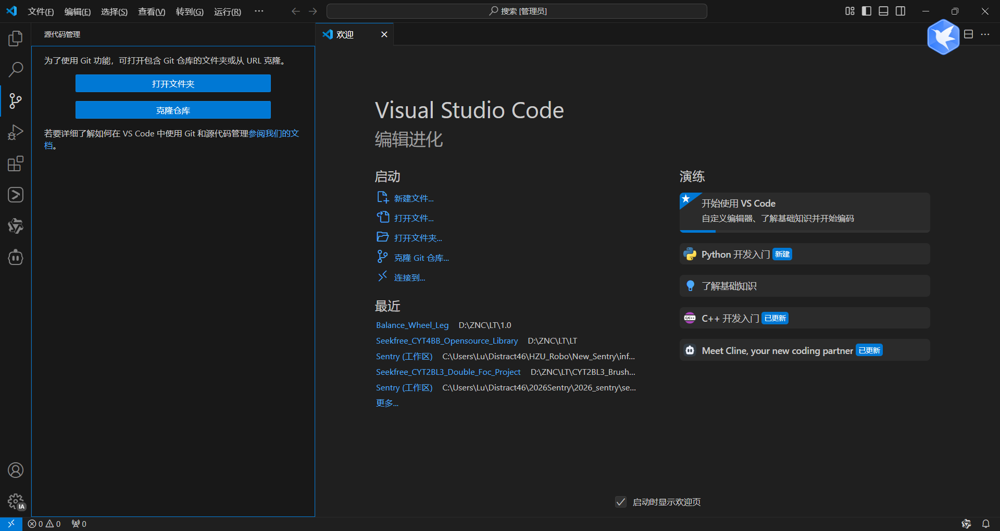
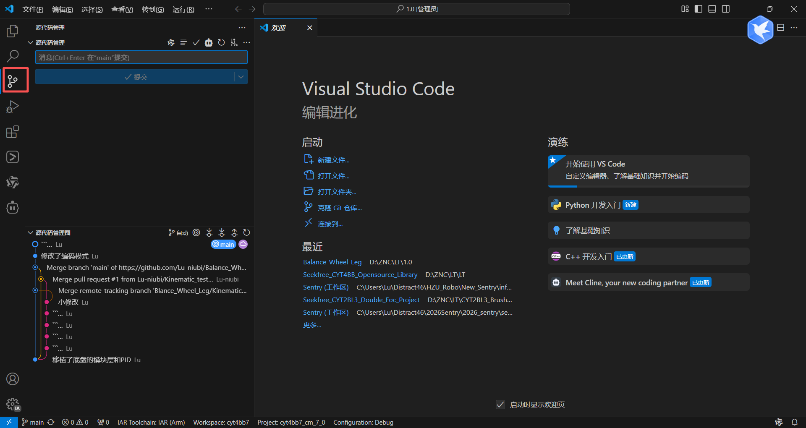
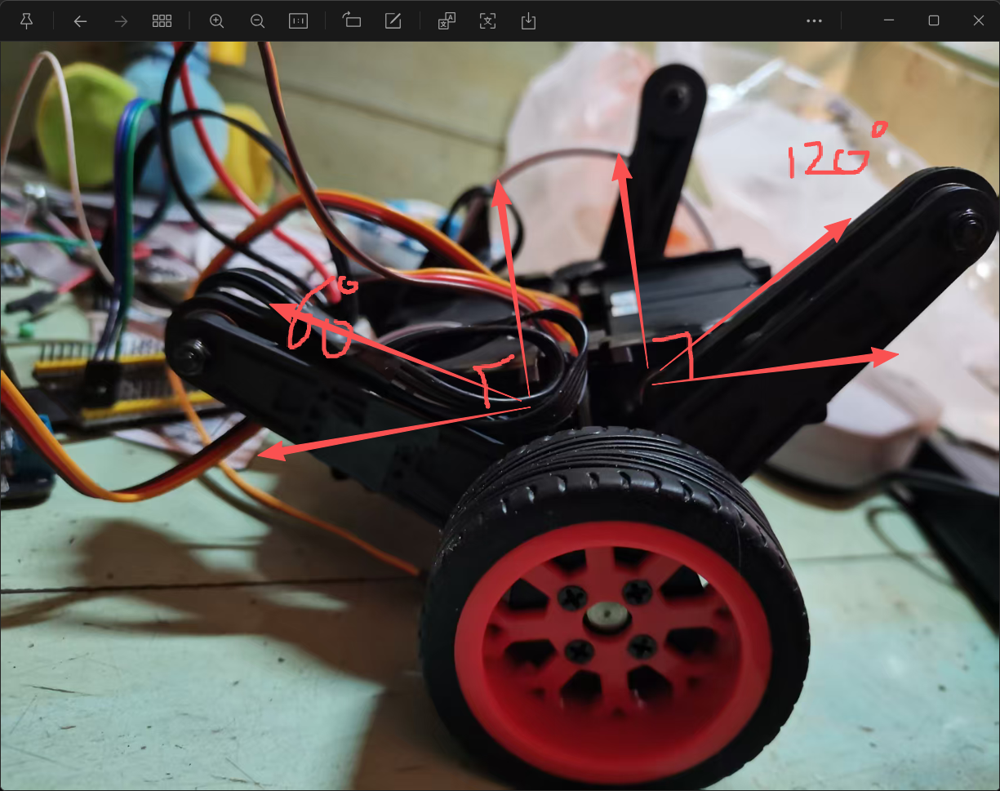
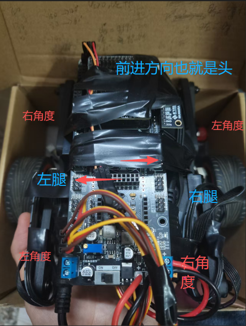
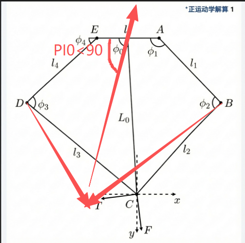

先安装vscode和IAR，IAR找逐飞拿下载教程或者网上找
下载插件以及拉取我的代码初始化github
IAR插件


拉取
在我的仓库找轮腿的代码，得先给我账号然后拉进工作空间

创建一个文件夹，终端输入命令拉取代码


将这个文件夹用vscode打开

这个地方操作一下应该就行了


舵机极性：Servo.h,Servo.c
平放时:所有舵机都为90

如果想将腿上抬一条腿的两个舵机是反着装的所以一个是90°+，一个是90°-：

以俯视角为例子
#define SERVO_CH1_PIN       (TCPWM_CH13_P00_3)//左下舵机  对应单脚左角度
#define SERVO_CH4_PIN       (TCPWM_CH04_P04_0)//左上舵机  对应单脚右角度

//电源线黑色线部分
#define SERVO_CH2_PIN       (TCPWM_CH12_P01_0)//右上舵机  对应单脚左角度
#define SERVO_CH3_PIN       (TCPWM_CH11_P01_1)//右下舵机  对应单脚右角度



* 正逆解运动学控制姿态：KS.C,KS.h
    * 基本函数：int FiveBar_FwdKinematics(float   phi1, float phi4, float* out_L0, float* out_phi0);
        给定两个角度得到最后的摆杆长度也就是腿长，和摆杆倾斜角rad
  * 注意：给的角度不是舵机的角度是仿真文件中的角度，我已经对对应的舵机角度进行了转换也就是映射

   * 仿真文件中的角度和舵机的角度对应关系：
     * 左角度：（是左角度不是左腿看上面的俯视图）：Left_transform_angle(float input_angle)
     * 右角度：float Right_Servo_Angle = phi4 + 90.0f;
     * 左角度对应PI1
     * 右角度对应PI4

按照那个俯视图看每条腿的对应左右角度是一致的

float Left_Servo_Angle = Left_transform_angle(phi1);

float Right_Servo_Angle = phi4 + 90.0f;


* 常用函数：
  * int Left_FiveBar_IK_Degree_Interface(float L0_mm, float phi0_deg, float* out_deg1, float* out_deg4);
  * int Right_FiveBar_IK_Degree_Interface(float L0_mm, float phi0_deg, float* out_deg1, float* out_deg4);
  * int FiveBar_IK_Degree_Interface(float L0_mm, float phi0_deg, float* out_deg1, float* out_deg4);

  正解分别单独控制两腿腿的姿态：给定腿长和摆杆偏角角度制控制舵机达到正确的位置：平的时候腿长为43.12mm
  腿部逆解控制 (重心偏移) ---逻辑：想前进(PID输出>0) -> 腿后摆(Pi0<90°) -> 摆杆前倾：基础角度 90度 - PID输出
  
  (PI0)target_leg_angle = 90.0f-speed_pid_out;

  int FiveBar_IK_Degree_Interface(float L0_mm, float phi0_deg, float* out_deg1, float* out_deg4);
  用于控制整体的腿长和前倾或后仰的函数，用法和刚刚的Left_FiveBar_IK_Degree_Interface，Right_FiveBar_IK_Degree_Interface这两个函数一样，腿长和角度作为输入。phi0_deg<90°前倾，phi0_deg>90°后仰

* PID与LQR：motor.c,motor.h(LQR可以先不用管比较难需要结合仿真去调)

  参数需要重新调

  PID控制：PID.md这个文件里用来存参数的，这几个参数都是之前调的大概范围在那里

  // 脚本调参2目前鲁棒性现在最好，机械结构以及电池更换硬件更换什么的换了都要重新调
  
  可以先用临界振荡法去调一个大概的参数再调优（逐飞的轮腿回放有教调的）
  #define GYRO_KP    刚度（小车硬不硬，体现在平稳后动一下就感觉给的力很大，越野路段应该偏软）
  #define ANG_KP     欲望（小车想归正的欲望，越大越快归正，但是也可能抖）
  #define ANG_KI     零点纠正（消除稳态误差）
  #define ANG_KD     小车抖就给一点
  #define GYRO_KI    0.0f     
  #define GYRO_KD    0.0f

  速度环可以粗调：主要是看动起来腿会不会有点过激的动或者腿都没怎么动就对应调kp
  


  


---

# 代码整体框架

```
project/
├── user/
│   ├── main_cm7_0.c        # 核心0主函数（平衡/运动控制）
│   ├── cm7_0_isr.c         # 核心0中断服务函数
│   ├── main_cm7_1.c        # 核心1主函数（待实现：摄像头/GPS）
│   └── cm7_1_isr.c         # 核心1中断服务函数
│
└── code/
    ├── ShareData.h          # 双核共享内存结构体（IPCS，地址0x28001000）
    ├── APP/
    │   └── chassic.h/.c     # APP层任务调度（科目判断逻辑放这里）
    └── Moudle/
        ├── Motor/           # 电机驱动 + PID/LQR平衡控制核心
        ├── ServoMotor/      # 舵机驱动（步进式，5ms定时器驱动）
        ├── KScalculat/      # 五连杆正逆运动学
        ├── IMU/             # IMU融合滤波（imu_sys.pitch/.gx/.gz）
        ├── RemoteController/ # Xbox手柄解析（核心1负责，写入IPCS->M1_Pub）
        ├── algorithm/       # PID通用算法库
        └── BSP/Motordrive/  # 电机驱动板UART通信
```

---

# 引脚分配

| 功能 | 引脚 | 宏定义 | 说明 |
|------|------|--------|------|
| 左下舵机 | P00_3 (TCPWM_CH13) | SERVO_CH1_PIN | 左腿左角度(phi1) |
| 左上舵机 | P04_0 (TCPWM_CH04) | SERVO_CH4_PIN | 左腿右角度(phi4) |
| 右上舵机 | P01_0 (TCPWM_CH12) | SERVO_CH2_PIN | 右腿左角度(phi1) |
| 右下舵机 | P01_1 (TCPWM_CH11) | SERVO_CH3_PIN | 右腿右角度(phi4) |
| 电机驱动 | UART4 | — | 小驱UART，uart_control_callback() |
| Xbox手柄 | UART1 | — | wireless_module_uart_handler() |
| IMU | I2C | — | imu660ra，逐飞库封装 |
| GPS/惯导 | UART2 | — | gnss_uart_callback()（已预留，待取消注释） |

舵机频率：300Hz，PWM公式：0.5 + angle/90.0 ms

---

# 系统初始化流程（核心0）

```c
clock_init(SYSTEM_CLOCK_250M);   // 1. 系统时钟250MHz
debug_init();
system_delay_init();

Servo_Init();                     // 2. 舵机初始化，所有舵机归90度
system_delay_ms(500);

Motor_Init();                     // 3. 电机初始化（内部调用PID或LQR Init）
Motor_Reset_State();              // 4. 清空所有PID积分项，电机输出0

imu660ra_init();                  // 5. IMU硬件初始化（失败循环等待）
IMU_Fusion_Init();                // 6. IMU融合初始化（静止约1秒校准）
Motor_Reset_State();              // 7. 再次清零

pit_ms_init(PIT_CH0, 1);         // 8. 1ms定时器 -> 平衡控制
pit_ms_init(PIT_CH1, 5);         // 9. 5ms定时器 -> Servo_Task步进
```

IMU校准期间必须保持小车静止，否则零点偏移导致平衡失败。

---

# PID开启方式

在 Motor.h 顶部选择控制模式（二选一）：

```c
#define USE_PID_CONTROL   // 当前默认，推荐
// #define USE_LQR_CONTROL  // 需结合MATLAB仿真，暂不推荐
```

机械零点偏移在 cm7_0_isr.c：
```c
#define PITCH_OFFSET 3.8f  // 静止时pitch不为0就调这个（单位：度）
```

当前生效参数（Motor.c，脚本调参2，鲁棒性最好）：
```c
#define GYRO_KP    191.433409f  // 角速度环Kp（刚度）
#define ANG_KP     1.321422f   // 角度环Kp（归正欲望）
#define ANG_KI     0.005641f   // 角度环Ki（消稳态误差）
#define ANG_KD     0.050830f   // 角度环Kd（抑制抖动）
#define SPD_KP     0.08f
#define SPD_KI     0.005f
```

调参顺序：先临界振荡法粗调 GYRO_KP，再调 ANG_KP，最后微调 ANG_KI/KD。换了硬件必须重新调。

---

# 运行逻辑（中断驱动）

```
1ms PIT_CH0 中断
  ├── 读IMU原始数据
  ├── IMU_Fusion_Update() -> imu_sys.pitch / gx / gz
  └── Motor_PID_Balance_Control(pitch, gx, gz)
        ├── 速度环(10ms执行一次)
        │     ├── 读 IPCS->M1_Pub.xbox_joy_l_vert（前后摇杆）
        │     ├── PID计算 -> 目标腿角度偏移
        │     └── Left/Right_FiveBar_IK_Degree_Interface() 逆解驱动舵机改变重心
        ├── 角度环(5ms执行一次)
        │     └── PID(pitch, 0) -> target_gyro_rate
        └── 角速度环(1ms每次)
              └── PID(gx, target_gyro_rate) -> PWM -> Motor_Set_Duty()

5ms PIT_CH1 中断
  └── Servo_Task()  // 舵机步进0.8度/次，平滑到达目标角度

主循环 while(true)
  └── SCB_InvalidateDCache_by_Addr(&IPCS->M1_Pub, ...)  // 刷新缓存读取核心1数据
```

速度和转向控制：将 IPCS->M1_Pub.xbox_joy_l_vert（前后）和 xbox_joy_l_hori（转向）替换成你想要的目标值即可，Map_Strange_Joystick() 已处理死区和极性。

---

# 双核通信机制

共享内存定义在 ShareData.h，固定物理地址 0x28001000：

```c
// 核心1写入后刷出缓存
IPCS->M1_Pub.xbox_joy_l_vert = target_speed;
SCB_CleanDCache_by_Addr((uint32_t *)&IPCS->M1_Pub, sizeof(IPCS->M1_Pub));

// 核心0读取前使缓存失效
SCB_InvalidateDCache_by_Addr((void *)&IPCS->M1_Pub, sizeof(IPCS->M1_Pub));
// 然后直接读 IPCS->M1_Pub.xxx
```

核心1框架建议（和核心0保持一致）：
- main_cm7_1.c：硬件初始化 + 启动定时器
- cm7_1_isr.c：中断服务（摄像头采集、GPS解析）
- code/APP/：科目识别判断，结果写入 IPCS->M1_Pub（需在ShareData.h扩展字段，如scene_type）
- code/Moudle/：摄像头模块、GPS模块
- BSP层逐飞已封装，基本不需要自己写

---

# 待办事项

## 1. 摄像头（核心1实现）

接入：逐飞库调用摄像头初始化，放核心1。采集任务放定时器中断或主循环。

识别任务放核心1 APP层，结果通过 IPCS->M1_Pub 传给核心0，核心0 APP层读取后决策：

- 三级台阶：识别连续三条横线，判断台阶数量和位置，对应科目触发爬台阶逻辑
- 单边桥：识别单侧窄条（参考去年逐飞回放单边桥识别方案）
- 白色方框：识别封闭矩形轮廓，判断进入时机

## 2. GPS导航 + 惯导

UART2已预留，取消 cm7_0_isr.c 中 uart2_isr 里 gnss_uart_callback() 的注释，实现该回调解析NMEA报文。

取点运动思路：
1. 记录起点或手动设定目标GPS坐标
2. 惯导（IMU积分）提供短期精确位移，GPS提供长期绝对定位修正
3. 计算当前位置到目标点的方向角，转换为转向控制量
4. 将目标速度和转向量替换 xbox_joy_l_vert/hori 对应的值传给平衡控制

## 3. 跳跃实现

注意：电池供电不足时舵机会卡顿，跳跃调试建议接稳压电源。

写独立的 Jump_Task() 函数放 APP 层，核心0根据摄像头传来的 scene_type 决定是否触发：

```c
// 跳跃时用正解获取当前腿状态
float L0, phi0;
FiveBar_FwdKinematics(current_phi1, current_phi4, &L0, &phi0);

// 动作序列：压腿蓄力 -> 快速伸腿弹跳 -> 腾空收腿 -> 落地伸腿缓冲
Left_FiveBar_IK_Degree_Interface(target_L0, 90.0f, &deg1, &deg4);
Right_FiveBar_IK_Degree_Interface(target_L0, 90.0f, &deg1, &deg4);
```

具体弹跳时序参考逐飞回放。

## 4. 单边桥实现

参考去年逐飞回放，核心思路：
- 摄像头识别到单边桥后切换单边桥模式
- 降低车速，适当增大 GYRO_KP 提高刚度
- 降低腿高（减小腿长）降低重心，提高稳定性
- 转向控制根据摄像头偏差修正，保持在桥面中央
